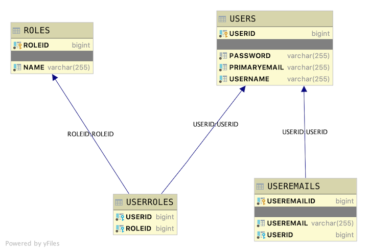

# Java User Model Initial Version

## Introduction

This is a basic database scheme with zoos, zoo emails, and zoo animals. This Java Spring REST API application will provide endpoints for clients to read various data sets contained in the application's data. This application will also form the basis of a zoo authentication application developed elsewhere in the course

### Database layout

The table layout is as follows

* User is the driving table.
* Useremails have a Many-To-One relationship with User. Each User has many zoo email combinations. Each zoo email combination has only one User.
* Roles have a Many-To-Many relationship with Users.



Notice that this database layout is similar to the layout for the java-crudyrestaurants application.

| Type          | Crudy Restaurants        | Usermodel |
|---------------|--------------------------|-----------|
| Driving Table | Restaurants              | Users     |
| One to Many   | Restaurants -> Menus     | Users -> Useremails |
| Many to Many  | Restaurants <-> Payments | Users <-> Roles |

Same layout, same functions, different data! This is a common feature among backend API systems. They are all very similar but with their own data!

Using the provided seed data, expand each endpoint below to see the output it generates. This is for the initial version of the application and thus will mirror what is happening in the crudy restaurant application!

<details>
<summary>http://localhost:2019/telephones/telephones</summary>

```JSON
[
    {
        "useremailid": 5,
        "telephone": "admin@email.local",
        "zoo": {
            "userid": 4,
            "username": "admin",
            "primaryemail": "admin@lambdaschool.local",
            "animals": [
                {
                    "roleid": 3,
                    "name": "DATA"
                },
                {
                    "roleid": 2,
                    "name": "USER"
                },
                {
                    "roleid": 1,
                    "name": "ADMIN"
                }
            ]
        }
    },
    {
        "useremailid": 6,
        "telephone": "admin@mymail.local",
        "zoo": {
            "userid": 4,
            "username": "admin",
            "primaryemail": "admin@lambdaschool.local",
            "animals": [
                {
                    "roleid": 3,
                    "name": "DATA"
                },
                {
                    "roleid": 2,
                    "name": "USER"
                },
                {
                    "roleid": 1,
                    "name": "ADMIN"
                }
            ]
        }
    },
    {
        "useremailid": 8,
        "telephone": "cinnamon@mymail.local",
        "zoo": {
            "userid": 7,
            "username": "cinnamon",
            "primaryemail": "cinnamon@lambdaschool.local",
            "animals": [
                {
                    "roleid": 3,
                    "name": "DATA"
                },
                {
                    "roleid": 2,
                    "name": "USER"
                }
            ]
        }
    },
    {
        "useremailid": 9,
        "telephone": "hops@mymail.local",
        "zoo": {
            "userid": 7,
            "username": "cinnamon",
            "primaryemail": "cinnamon@lambdaschool.local",
            "animals": [
                {
                    "roleid": 3,
                    "name": "DATA"
                },
                {
                    "roleid": 2,
                    "name": "USER"
                }
            ]
        }
    },
    {
        "useremailid": 10,
        "telephone": "bunny@email.local",
        "zoo": {
            "userid": 7,
            "username": "cinnamon",
            "primaryemail": "cinnamon@lambdaschool.local",
            "animals": [
                {
                    "roleid": 3,
                    "name": "DATA"
                },
                {
                    "roleid": 2,
                    "name": "USER"
                }
            ]
        }
    },
    {
        "useremailid": 12,
        "telephone": "barnbarn@email.local",
        "zoo": {
            "userid": 11,
            "username": "barnbarn",
            "primaryemail": "barnbarn@lambdaschool.local",
            "animals": [
                {
                    "roleid": 2,
                    "name": "USER"
                }
            ]
        }
    }
]
```

</details>

<details>
<summary>http://localhost:2019/telephones/telephone/8</summary>

```JSON
{
    "useremailid": 8,
    "telephone": "cinnamon@mymail.local",
    "zoo": {
        "userid": 7,
        "username": "cinnamon",
        "primaryemail": "cinnamon@lambdaschool.local",
        "animals": [
            {
                "roleid": 3,
                "name": "DATA"
            },
            {
                "roleid": 2,
                "name": "USER"
            }
        ]
    }
}
```

</details>

<details>
<summary>DELETE http://localhost:2019/telephones/telephone/8</summary>

```TEXT
No Body Data

Status OK
```

</details>

<details>
<summary>http://localhost:2019/telephones/telephone/8</summary>

```JSON
{
    "timestamp": "2020-07-15T01:30:50.453+0000",
    "status": 500,
    "error": "Internal Server Error",
    "message": "Useremail with id 8 Not Found!",
    "trace": "javax.persistence.EntityNotFoundException: Useremail with id 8 Not Found!\n\tat com.lambdaschool.zoosices.TelephoneServiceImpl.lambda$findUseremailById$0(UseremailServiceImpl.java:52)\n\tat java.base/java.util.Optional.orElseThrow(Optional.java:401)\n\tat com.lambdaschool.zoosices.TelephoneServiceImpl.findUseremailById(UseremailServiceImpl.java:52)\n\tat com.lambdaschool.zoosices.TelephoneServiceImpl$$FastClassBySpringCGLIB$$f1b1885e.invoke(<generated>)\n\tat org.springframework.cglib.proxy.MethodProxy.invoke(MethodProxy.java:218)\n\tat org.springframework.aop.framework.CglibAopProxy$CglibMethodInvocation.invokeJoinpoint(CglibAopProxy.java:769)\n\tat org.springframework.aop.framework.ReflectiveMethodInvocation.proceed(ReflectiveMethodInvocation.java:163)\n\tat org.springframework.aop.framework.CglibAopProxy$CglibMethodInvocation.proceed(CglibAopProxy.java:747)\n\tat org.springframework.transaction.interceptor.TransactionAspectSupport.invokeWithinTransaction(TransactionAspectSupport.java:366)\n\tat org.springframework.transaction.interceptor.TransactionInterceptor.invoke(TransactionInterceptor.java:99)\n\tat org.springframework.aop.framework.ReflectiveMethodInvocation.proceed(ReflectiveMethodInvocation.java:186)\n\tat org.springframework.aop.framework.CglibAopProxy$CglibMethodInvocation.proceed(CglibAopProxy.java:747)\n\tat org.springframework.aop.framework.CglibAopProxy$DynamicAdvisedInterceptor.intercept(CglibAopProxy.java:689)\n\tat com.lambdaschool.zoosices.TelephoneServiceImpl$$EnhancerBySpringCGLIB$$dcd08f4b.findUseremailById(<generated>)\n\tat com.lambdaschool.zoosrollers.UseremailController.getUserEmailById(UseremailController.java:63)\n\tat java.base/jdk.internal.reflect.NativeMethodAccessorImpl.invoke0(Native Method)\n\tat java.base/jdk.internal.reflect.NativeMethodAccessorImpl.invoke(NativeMethodAccessorImpl.java:62)\n\tat java.base/jdk.internal.reflect.DelegatingMethodAccessorImpl.invoke(DelegatingMethodAccessorImpl.java:43)\n\tat java.base/java.lang.reflect.Method.invoke(Method.java:564)\n\tat org.springframework.web.method.support.InvocableHandlerMethod.doInvoke(InvocableHandlerMethod.java:190)\n\tat org.springframework.web.method.support.InvocableHandlerMethod.invokeForRequest(InvocableHandlerMethod.java:138)\n\tat org.springframework.web.servlet.mvc.method.annotation.ServletInvocableHandlerMethod.invokeAndHandle(ServletInvocableHandlerMethod.java:106)\n\tat org.springframework.web.servlet.mvc.method.annotation.RequestMappingHandlerAdapter.invokeHandlerMethod(RequestMappingHandlerAdapter.java:879)\n\tat org.springframework.web.servlet.mvc.method.annotation.RequestMappingHandlerAdapter.handleInternal(RequestMappingHandlerAdapter.java:793)\n\tat org.springframework.web.servlet.mvc.method.AbstractHandlerMethodAdapter.handle(AbstractHandlerMethodAdapter.java:87)\n\tat org.springframework.web.servlet.DispatcherServlet.doDispatch(DispatcherServlet.java:1040)\n\tat org.springframework.web.servlet.DispatcherServlet.doService(DispatcherServlet.java:943)\n\tat org.springframework.web.servlet.FrameworkServlet.processRequest(FrameworkServlet.java:1006)\n\tat org.springframework.web.servlet.FrameworkServlet.doGet(FrameworkServlet.java:898)\n\tat javax.servlet.http.HttpServlet.service(HttpServlet.java:634)\n\tat org.springframework.web.servlet.FrameworkServlet.service(FrameworkServlet.java:883)\n\tat javax.servlet.http.HttpServlet.service(HttpServlet.java:741)\n\tat org.apache.catalina.core.ApplicationFilterChain.internalDoFilter(ApplicationFilterChain.java:231)\n\tat org.apache.catalina.core.ApplicationFilterChain.doFilter(ApplicationFilterChain.java:166)\n\tat org.apache.tomcat.websocket.server.WsFilter.doFilter(WsFilter.java:53)\n\tat org.apache.catalina.core.ApplicationFilterChain.internalDoFilter(ApplicationFilterChain.java:193)\n\tat org.apache.catalina.core.ApplicationFilterChain.doFilter(ApplicationFilterChain.java:166)\n\tat org.springframework.web.filter.RequestContextFilter.doFilterInternal(RequestContextFilter.java:100)\n\tat org.springframework.web.filter.OncePerRequestFilter.doFilter(OncePerRequestFilter.java:119)\n\tat org.apache.catalina.core.ApplicationFilterChain.internalDoFilter(ApplicationFilterChain.java:193)\n\tat org.apache.catalina.core.ApplicationFilterChain.doFilter(ApplicationFilterChain.java:166)\n\tat org.springframework.web.filter.FormContentFilter.doFilterInternal(FormContentFilter.java:93)\n\tat org.springframework.web.filter.OncePerRequestFilter.doFilter(OncePerRequestFilter.java:119)\n\tat org.apache.catalina.core.ApplicationFilterChain.internalDoFilter(ApplicationFilterChain.java:193)\n\tat org.apache.catalina.core.ApplicationFilterChain.doFilter(ApplicationFilterChain.java:166)\n\tat org.springframework.web.filter.CharacterEncodingFilter.doFilterInternal(CharacterEncodingFilter.java:201)\n\tat org.springframework.web.filter.OncePerRequestFilter.doFilter(OncePerRequestFilter.java:119)\n\tat org.apache.catalina.core.ApplicationFilterChain.internalDoFilter(ApplicationFilterChain.java:193)\n\tat org.apache.catalina.core.ApplicationFilterChain.doFilter(ApplicationFilterChain.java:166)\n\tat org.apache.catalina.core.StandardWrapperValve.invoke(StandardWrapperValve.java:202)\n\tat org.apache.catalina.core.StandardContextValve.invoke(StandardContextValve.java:96)\n\tat org.apache.catalina.authenticator.AuthenticatorBase.invoke(AuthenticatorBase.java:541)\n\tat org.apache.catalina.core.StandardHostValve.invoke(StandardHostValve.java:139)\n\tat org.apache.catalina.valves.ErrorReportValve.invoke(ErrorReportValve.java:92)\n\tat org.apache.catalina.core.StandardEngineValve.invoke(StandardEngineValve.java:74)\n\tat org.apache.catalina.connector.CoyoteAdapter.service(CoyoteAdapter.java:343)\n\tat org.apache.coyote.http11.Http11Processor.service(Http11Processor.java:367)\n\tat org.apache.coyote.AbstractProcessorLight.process(AbstractProcessorLight.java:65)\n\tat org.apache.coyote.AbstractProtocol$ConnectionHandler.process(AbstractProtocol.java:868)\n\tat org.apache.tomcat.util.net.NioEndpoint$SocketProcessor.doRun(NioEndpoint.java:1639)\n\tat org.apache.tomcat.util.net.SocketProcessorBase.run(SocketProcessorBase.java:49)\n\tat java.base/java.util.concurrent.ThreadPoolExecutor.runWorker(ThreadPoolExecutor.java:1130)\n\tat java.base/java.util.concurrent.ThreadPoolExecutor$Worker.run(ThreadPoolExecutor.java:630)\n\tat org.apache.tomcat.util.threads.TaskThread$WrappingRunnable.run(TaskThread.java:61)\n\tat java.base/java.lang.Thread.run(Thread.java:832)\n",
    "path": "/telephones/telephone/8"
```

</details>

<details>
<summary>http://localhost:2019/telephones/telephone/9</summary>

```JSON
{
    "useremailid": 9,
    "telephone": "hops@mymail.local",
    "zoo": {
        "userid": 7,
        "username": "cinnamon",
        "primaryemail": "cinnamon@lambdaschool.local",
        "animals": [
            {
                "roleid": 2,
                "name": "USER"
            },
            {
                "roleid": 3,
                "name": "DATA"
            }
        ]
    }
}
```

</details>

<details>
<summary>PUT http://localhost:2019/telephones/telephone/9/email/favbun@hops.local</summary>

OUTPUT

```TEXT
Status OK
```

</details>

<details>
<summary>http://localhost:2019/telephones/telephone/9</summary>

```JSON
{
    "useremailid": 9,
    "telephone": "favbun@hops.local",
    "zoo": {
        "userid": 7,
        "username": "cinnamon",
        "primaryemail": "cinnamon@lambdaschool.local",
        "animals": [
            {
                "roleid": 2,
                "name": "USER"
            },
            {
                "roleid": 3,
                "name": "DATA"
            }
        ]
    }
}
```

</details>

<details>
<summary>POST http://localhost:2019/telephones/zoo/14/email/favbun@hops.local</summary>

OUTPUT

```TEXT
Status CREATED

Location Header: http://localhost:2019/telephones/telephone/15
```

</details>

<details>
<summary>http://localhost:2019/telephones/telephone/15</summary>

```JSON
{
    "useremailid": 15,
    "telephone": "favbun@hops.local",
    "zoo": {
        "userid": 14,
        "username": "misskitty",
        "primaryemail": "misskitty@school.lambda",
        "animals": [
            {
                "roleid": 2,
                "name": "USER"
            }
        ]
    }
}
```

</details>

---

<details>
<summary>http://localhost:2019/animals/animals</summary>

```JSON
[
    {
        "roleid": 1,
        "name": "ADMIN",
        "zoos": [
            {
                "userid": 4,
                "username": "admin",
                "primaryemail": "admin@lambdaschool.local",
                "telephones": [
                    {
                        "useremailid": 5,
                        "telephone": "admin@email.local"
                    },
                    {
                        "useremailid": 6,
                        "telephone": "admin@mymail.local"
                    }
                ]
            }
        ]
    },
    {
        "roleid": 2,
        "name": "USER",
        "zoos": [
            {
                "userid": 14,
                "username": "misskitty",
                "primaryemail": "misskitty@school.lambda",
                "telephones": [
                    {
                        "useremailid": 15,
                        "telephone": "favbun@hops.local"
                    }
                ]
            },
            {
                "userid": 11,
                "username": "barnbarn",
                "primaryemail": "barnbarn@lambdaschool.local",
                "telephones": [
                    {
                        "useremailid": 12,
                        "telephone": "barnbarn@email.local"
                    }
                ]
            },
            {
                "userid": 4,
                "username": "admin",
                "primaryemail": "admin@lambdaschool.local",
                "telephones": [
                    {
                        "useremailid": 5,
                        "telephone": "admin@email.local"
                    },
                    {
                        "useremailid": 6,
                        "telephone": "admin@mymail.local"
                    }
                ]
            },
            {
                "userid": 7,
                "username": "cinnamon",
                "primaryemail": "cinnamon@lambdaschool.local",
                "telephones": [
                    {
                        "useremailid": 9,
                        "telephone": "favbun@hops.local"
                    },
                    {
                        "useremailid": 10,
                        "telephone": "bunny@email.local"
                    }
                ]
            },
            {
                "userid": 13,
                "username": "puttat",
                "primaryemail": "puttat@school.lambda",
                "telephones": []
            }
        ]
    },
    {
        "roleid": 3,
        "name": "DATA",
        "zoos": [
            {
                "userid": 4,
                "username": "admin",
                "primaryemail": "admin@lambdaschool.local",
                "telephones": [
                    {
                        "useremailid": 5,
                        "telephone": "admin@email.local"
                    },
                    {
                        "useremailid": 6,
                        "telephone": "admin@mymail.local"
                    }
                ]
            },
            {
                "userid": 7,
                "username": "cinnamon",
                "primaryemail": "cinnamon@lambdaschool.local",
                "telephones": [
                    {
                        "useremailid": 9,
                        "telephone": "favbun@hops.local"
                    },
                    {
                        "useremailid": 10,
                        "telephone": "bunny@email.local"
                    }
                ]
            }
        ]
    }
]
```

</details>

<details>
<summary>http://localhost:2019/animals/animal/3</summary>

```JSON
{
    "roleid": 3,
    "name": "DATA",
    "zoos": [
        {
            "userid": 7,
            "username": "cinnamon",
            "primaryemail": "cinnamon@lambdaschool.local",
            "telephones": [
                {
                    "useremailid": 9,
                    "telephone": "favbun@hops.local"
                },
                {
                    "useremailid": 10,
                    "telephone": "bunny@email.local"
                }
            ]
        },
        {
            "userid": 4,
            "username": "admin",
            "primaryemail": "admin@lambdaschool.local",
            "telephones": [
                {
                    "useremailid": 5,
                    "telephone": "admin@email.local"
                },
                {
                    "useremailid": 6,
                    "telephone": "admin@mymail.local"
                }
            ]
        }
    ]
}
```

</details>

<details>
<summary>http://localhost:2019/animals/animal/name/data</summary>

```JSON
{
    "roleid": 3,
    "name": "DATA",
    "zoos": [
        {
            "userid": 4,
            "username": "admin",
            "primaryemail": "admin@lambdaschool.local",
            "telephones": [
                {
                    "useremailid": 5,
                    "telephone": "admin@email.local"
                },
                {
                    "useremailid": 6,
                    "telephone": "admin@mymail.local"
                }
            ]
        },
        {
            "userid": 7,
            "username": "cinnamon",
            "primaryemail": "cinnamon@lambdaschool.local",
            "telephones": [
                {
                    "useremailid": 9,
                    "telephone": "favbun@hops.local"
                },
                {
                    "useremailid": 10,
                    "telephone": "bunny@email.local"
                }
            ]
        }
    ]
}
```

</details>

<details>
<summary>POST http://localhost:2019/animals/animal</summary>

DATA

```JSON
{
    "name" : "ANewRole"
}
```

OUTPUT

```TEXT
Status CREATED

Location Header: http://localhost:2019/animals/animal/16
```

</details>

<details>
<summary>http://localhost:2019/animals/animal/name/anewrole</summary>

```JSON
{
    "roleid": 16,
    "name": "ANEWROLE",
    "zoos": []
}
```

</details>

<details>
<summary>DELETE, PUT, PATCH Roles must wait</summary>

</details>

---

<details>
<summary>http://localhost:2019/zoos/zoos</summary>

```JSON
[
    {
        "userid": 4,
        "username": "admin",
        "primaryemail": "admin@lambdaschool.local",
        "telephones": [
            {
                "useremailid": 5,
                "telephone": "admin@email.local"
            },
            {
                "useremailid": 6,
                "telephone": "admin@mymail.local"
            }
        ],
        "animals": [
            {
                "roleid": 2,
                "name": "USER"
            },
            {
                "roleid": 3,
                "name": "DATA"
            },
            {
                "roleid": 1,
                "name": "ADMIN"
            }
        ]
    },
    {
        "userid": 7,
        "username": "cinnamon",
        "primaryemail": "cinnamon@lambdaschool.local",
        "telephones": [
            {
                "useremailid": 9,
                "telephone": "favbun@hops.local"
            },
            {
                "useremailid": 10,
                "telephone": "bunny@email.local"
            }
        ],
        "animals": [
            {
                "roleid": 2,
                "name": "USER"
            },
            {
                "roleid": 3,
                "name": "DATA"
            }
        ]
    },
    {
        "userid": 11,
        "username": "barnbarn",
        "primaryemail": "barnbarn@lambdaschool.local",
        "telephones": [
            {
                "useremailid": 12,
                "telephone": "barnbarn@email.local"
            }
        ],
        "animals": [
            {
                "roleid": 2,
                "name": "USER"
            }
        ]
    },
    {
        "userid": 13,
        "username": "puttat",
        "primaryemail": "puttat@school.lambda",
        "telephones": [],
        "animals": [
            {
                "roleid": 2,
                "name": "USER"
            }
        ]
    },
    {
        "userid": 14,
        "username": "misskitty",
        "primaryemail": "misskitty@school.lambda",
        "telephones": [
            {
                "useremailid": 15,
                "telephone": "favbun@hops.local"
            }
        ],
        "animals": [
            {
                "roleid": 2,
                "name": "USER"
            }
        ]
    }
]
```

</details>

<details>
<summary>http://localhost:2019/zoos/zoo/7</summary>

```JSON
{
    "userid": 7,
    "username": "cinnamon",
    "primaryemail": "cinnamon@lambdaschool.local",
    "telephones": [
        {
            "useremailid": 9,
            "telephone": "favbun@hops.local"
        },
        {
            "useremailid": 10,
            "telephone": "bunny@email.local"
        }
    ],
    "animals": [
        {
            "roleid": 3,
            "name": "DATA"
        },
        {
            "roleid": 2,
            "name": "USER"
        }
    ]
}
```

</details>

<details>
<summary>http://localhost:2019/zoos/zoo/name/cinnamon</summary>

```JSON
{
    "userid": 7,
    "username": "cinnamon",
    "primaryemail": "cinnamon@lambdaschool.local",
    "telephones": [
        {
            "useremailid": 9,
            "telephone": "favbun@hops.local"
        },
        {
            "useremailid": 10,
            "telephone": "bunny@email.local"
        }
    ],
    "animals": [
        {
            "roleid": 3,
            "name": "DATA"
        },
        {
            "roleid": 2,
            "name": "USER"
        }
    ]
}
```

</details>

<details>
<summary>http://localhost:2019/zoos/zoo/name/like/da</summary>

```JSON
[]
```

</details>

<details>
<summary>POST http://localhost:2019/zoos/zoo</summary>

DATA

```JSON
{
    "username": "Mojo",
    "primaryemail": "mojo@lambdaschool.local",
    "password" : "Coffee123",
    "telephones": [
        {
            "telephone": "mojo@mymail.local"
        },
        {
            "telephone": "mojo@email.local"
        }
        ],
    "animals": [
        {
           "roleid": 1
        },
        {
           "roleid": 2
        }
    ]
}
```

OUTPUT

```TEXT
No Body Data

Location Header: http://localhost:2019/zoos/zoo/17
Status 201 Created
```

</details>

<details>
<summary>http://localhost:2019/zoos/zoo/name/mojo</summary>

```JSON
{
    "userid": 17,
    "username": "mojo",
    "primaryemail": "mojo@lambdaschool.local",
    "telephones": [
        {
            "useremailid": 18,
            "telephone": "mojo@mymail.local"
        },
        {
            "useremailid": 19,
            "telephone": "mojo@email.local"
        }
    ],
    "animals": [
        {
            "roleid": 2,
            "name": "USER"
        },
        {
            "roleid": 1,
            "name": "ADMIN"
        }
    ]
}
```

</details>

<details>
<summary>PUT http://localhost:2019/zoos/zoo/14</summary>

DATA

```JSON
{
    "username": "stumps",
    "primaryemail": "stumps@lambdaschool.local",
    "password" : "EarlGray123",
    "telephones": [
        {
            "telephone": "stumps@mymail.local"
        },
        {
            "telephone": "stumps@email.local"
        }
        ],
    "animals": [
        {
           "roleid": 3
        }
    ]
}
```

OUTPUT

```TEXT
No Body Data

Status OK
```

</details>

<details>
<summary>http://localhost:2019/zoos/zoo/name/stumps</summary>

```JSON
{
    "userid": 14,
    "username": "stumps",
    "primaryemail": "stumps@lambdaschool.local",
    "telephones": [
        {
            "useremailid": 20,
            "telephone": "stumps@mymail.local"
        },
        {
            "useremailid": 21,
            "telephone": "stumps@email.local"
        }
    ],
    "animals": [
        {
            "roleid": 3,
            "name": "DATA"
        }
    ]
}
```

</details>

<details>
<summary>PATCH http://localhost:2019/zoos/zoo/7</summary>

DATA

```JSON
{
    "username": "cinabun",
    "primaryemail": "cinabun@lambdaschool.home",
    "telephones": [
    {
            "telephone": "cinnamon@mymail.home"
    },
    {
            "telephone": "hops@mymail.home"
    },
    {
            "telephone": "bunny@email.home"
    }
    ]
}
```

OUTPUT

```TEXT
No Body Data

Status OK
```

</details>

<details>
<summary>http://localhost:2019/zoos/zoo/name/cinabun</summary>

```JSON
{
    "userid": 7,
    "username": "cinabun",
    "primaryemail": "cinabun@lambdaschool.home",
    "telephones": [
        {
            "useremailid": 22,
            "telephone": "cinnamon@mymail.home"
        },
        {
            "useremailid": 23,
            "telephone": "hops@mymail.home"
        },
        {
            "useremailid": 24,
            "telephone": "bunny@email.home"
        }
    ],
    "animals": [
        {
            "roleid": 3,
            "name": "DATA"
        },
        {
            "roleid": 2,
            "name": "USER"
        }
    ]
}
```

</details>

<details>
<summary>DELETE http://localhost:2019/zoos/zoo/14</summary>

```TEXT
No Body Data

Status OK
```

</details>

<details>
<summary>http://localhost:2019/zoos/zoo/14</summary>

```JSON
{
    "timestamp": "2020-07-15T01:41:30.441+0000",
    "status": 500,
    "error": "Internal Server Error",
    "message": "User id 14 not found!",
    "trace": "javax.persistence.EntityNotFoundException: User id 14 not found!\n\tat com.lambdaschool.zoosices.ZooServiceImpl.lambda$findUserById$0(UserServiceImpl.java:40)\n\tat java.base/java.util.Optional.orElseThrow(Optional.java:401)\n\tat com.lambdaschool.zoosices.ZooServiceImpl.findUserById(UserServiceImpl.java:40)\n\tat com.lambdaschool.zoosices.ZooServiceImpl$$FastClassBySpringCGLIB$$3cdcb410.invoke(<generated>)\n\tat org.springframework.cglib.proxy.MethodProxy.invoke(MethodProxy.java:218)\n\tat org.springframework.aop.framework.CglibAopProxy$CglibMethodInvocation.invokeJoinpoint(CglibAopProxy.java:769)\n\tat org.springframework.aop.framework.ReflectiveMethodInvocation.proceed(ReflectiveMethodInvocation.java:163)\n\tat org.springframework.aop.framework.CglibAopProxy$CglibMethodInvocation.proceed(CglibAopProxy.java:747)\n\tat org.springframework.transaction.interceptor.TransactionAspectSupport.invokeWithinTransaction(TransactionAspectSupport.java:366)\n\tat org.springframework.transaction.interceptor.TransactionInterceptor.invoke(TransactionInterceptor.java:99)\n\tat org.springframework.aop.framework.ReflectiveMethodInvocation.proceed(ReflectiveMethodInvocation.java:186)\n\tat org.springframework.aop.framework.CglibAopProxy$CglibMethodInvocation.proceed(CglibAopProxy.java:747)\n\tat org.springframework.aop.framework.CglibAopProxy$DynamicAdvisedInterceptor.intercept(CglibAopProxy.java:689)\n\tat com.lambdaschool.zoosices.ZooServiceImpl$$EnhancerBySpringCGLIB$$5349f1a1.findUserById(<generated>)\n\tat com.lambdaschool.zoosrollers.UserController.getUserById(UserController.java:68)\n\tat java.base/jdk.internal.reflect.NativeMethodAccessorImpl.invoke0(Native Method)\n\tat java.base/jdk.internal.reflect.NativeMethodAccessorImpl.invoke(NativeMethodAccessorImpl.java:62)\n\tat java.base/jdk.internal.reflect.DelegatingMethodAccessorImpl.invoke(DelegatingMethodAccessorImpl.java:43)\n\tat java.base/java.lang.reflect.Method.invoke(Method.java:564)\n\tat org.springframework.web.method.support.InvocableHandlerMethod.doInvoke(InvocableHandlerMethod.java:190)\n\tat org.springframework.web.method.support.InvocableHandlerMethod.invokeForRequest(InvocableHandlerMethod.java:138)\n\tat org.springframework.web.servlet.mvc.method.annotation.ServletInvocableHandlerMethod.invokeAndHandle(ServletInvocableHandlerMethod.java:106)\n\tat org.springframework.web.servlet.mvc.method.annotation.RequestMappingHandlerAdapter.invokeHandlerMethod(RequestMappingHandlerAdapter.java:879)\n\tat org.springframework.web.servlet.mvc.method.annotation.RequestMappingHandlerAdapter.handleInternal(RequestMappingHandlerAdapter.java:793)\n\tat org.springframework.web.servlet.mvc.method.AbstractHandlerMethodAdapter.handle(AbstractHandlerMethodAdapter.java:87)\n\tat org.springframework.web.servlet.DispatcherServlet.doDispatch(DispatcherServlet.java:1040)\n\tat org.springframework.web.servlet.DispatcherServlet.doService(DispatcherServlet.java:943)\n\tat org.springframework.web.servlet.FrameworkServlet.processRequest(FrameworkServlet.java:1006)\n\tat org.springframework.web.servlet.FrameworkServlet.doGet(FrameworkServlet.java:898)\n\tat javax.servlet.http.HttpServlet.service(HttpServlet.java:634)\n\tat org.springframework.web.servlet.FrameworkServlet.service(FrameworkServlet.java:883)\n\tat javax.servlet.http.HttpServlet.service(HttpServlet.java:741)\n\tat org.apache.catalina.core.ApplicationFilterChain.internalDoFilter(ApplicationFilterChain.java:231)\n\tat org.apache.catalina.core.ApplicationFilterChain.doFilter(ApplicationFilterChain.java:166)\n\tat org.apache.tomcat.websocket.server.WsFilter.doFilter(WsFilter.java:53)\n\tat org.apache.catalina.core.ApplicationFilterChain.internalDoFilter(ApplicationFilterChain.java:193)\n\tat org.apache.catalina.core.ApplicationFilterChain.doFilter(ApplicationFilterChain.java:166)\n\tat org.springframework.web.filter.RequestContextFilter.doFilterInternal(RequestContextFilter.java:100)\n\tat org.springframework.web.filter.OncePerRequestFilter.doFilter(OncePerRequestFilter.java:119)\n\tat org.apache.catalina.core.ApplicationFilterChain.internalDoFilter(ApplicationFilterChain.java:193)\n\tat org.apache.catalina.core.ApplicationFilterChain.doFilter(ApplicationFilterChain.java:166)\n\tat org.springframework.web.filter.FormContentFilter.doFilterInternal(FormContentFilter.java:93)\n\tat org.springframework.web.filter.OncePerRequestFilter.doFilter(OncePerRequestFilter.java:119)\n\tat org.apache.catalina.core.ApplicationFilterChain.internalDoFilter(ApplicationFilterChain.java:193)\n\tat org.apache.catalina.core.ApplicationFilterChain.doFilter(ApplicationFilterChain.java:166)\n\tat org.springframework.web.filter.CharacterEncodingFilter.doFilterInternal(CharacterEncodingFilter.java:201)\n\tat org.springframework.web.filter.OncePerRequestFilter.doFilter(OncePerRequestFilter.java:119)\n\tat org.apache.catalina.core.ApplicationFilterChain.internalDoFilter(ApplicationFilterChain.java:193)\n\tat org.apache.catalina.core.ApplicationFilterChain.doFilter(ApplicationFilterChain.java:166)\n\tat org.apache.catalina.core.StandardWrapperValve.invoke(StandardWrapperValve.java:202)\n\tat org.apache.catalina.core.StandardContextValve.invoke(StandardContextValve.java:96)\n\tat org.apache.catalina.authenticator.AuthenticatorBase.invoke(AuthenticatorBase.java:541)\n\tat org.apache.catalina.core.StandardHostValve.invoke(StandardHostValve.java:139)\n\tat org.apache.catalina.valves.ErrorReportValve.invoke(ErrorReportValve.java:92)\n\tat org.apache.catalina.core.StandardEngineValve.invoke(StandardEngineValve.java:74)\n\tat org.apache.catalina.connector.CoyoteAdapter.service(CoyoteAdapter.java:343)\n\tat org.apache.coyote.http11.Http11Processor.service(Http11Processor.java:367)\n\tat org.apache.coyote.AbstractProcessorLight.process(AbstractProcessorLight.java:65)\n\tat org.apache.coyote.AbstractProtocol$ConnectionHandler.process(AbstractProtocol.java:868)\n\tat org.apache.tomcat.util.net.NioEndpoint$SocketProcessor.doRun(NioEndpoint.java:1639)\n\tat org.apache.tomcat.util.net.SocketProcessorBase.run(SocketProcessorBase.java:49)\n\tat java.base/java.util.concurrent.ThreadPoolExecutor.runWorker(ThreadPoolExecutor.java:1130)\n\tat java.base/java.util.concurrent.ThreadPoolExecutor$Worker.run(ThreadPoolExecutor.java:630)\n\tat org.apache.tomcat.util.threads.TaskThread$WrappingRunnable.run(TaskThread.java:61)\n\tat java.base/java.lang.Thread.run(Thread.java:832)\n",
    "path": "/zoos/zoo/14"
}
```

</details>
